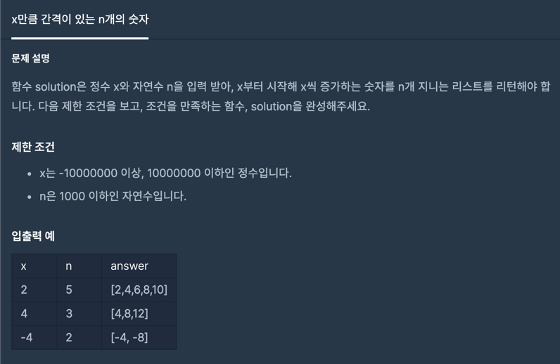

# x만큼 간격이 있는 n개의 숫자

1. 문제


2. 코드 설명

``` java
public static long[] solution(int x, int n) { // 정수 x와, 자연수 n을 받을 파라미터
    long[] answer = new long[n]; // 답을 담을 answer long타입 배열 선언
    long temp = x; // 정수를 받을 long 타입 temp 선언
    for(int i = 0; i < n; i++){
        answer[i] = temp * (i+1); // for문을 실행하면서 answer 배열 안에 temp * 1씩늘어나는 숫자 로 배열에 넣어줌
    }
    return answer; // 정답 반환
}
```

3. 다시 되새긴점   

int 자료형은 32bit를 사용하고 long 자료형은 64bit를 사용한다.   
```
int는 32bit   
00000000 00000000 00000000 00000000
```
```
long은 64bit 이므로 8개짜리가 8개 이다.

00000000 00000000 00000000 00000000

00000000 00000000 00000000 00000000
```

```
int는

-2147483648 ~ 2147483647

long은

-9223372036854775808 ~ 9223372036854775807

까지 표현할 수 있다.
```