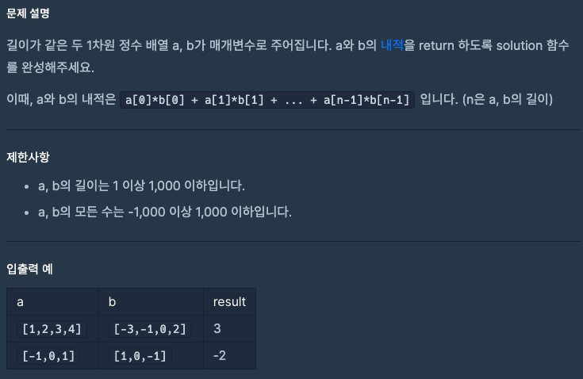

### 문제


<br>

### 풀이
```javascript
function solution(a, b) {
    var answer = 0;
    for(var i = 0; i < a.length; i++) answer += a[i] * b[i];
    return answer;
}
```
<br>

먼저 `answer` 변수의 값을 0으로 할당함으로써 자료형을 number로 지정한다.<br>
<br>

그 다음 a와 b의 내적은 `a[n] * b[n]`으로 구한다.<br>
이때, n은 배열의 길이만큼 늘어난다.<br>
<br>

그래서 n을 변수 i로 바꾸고 for문으로 작성하여 a와 b의 내적을 구하고,<br>
이 결과 값을 answer에 누적시키고 마지막으로 answer를 return 한다.

