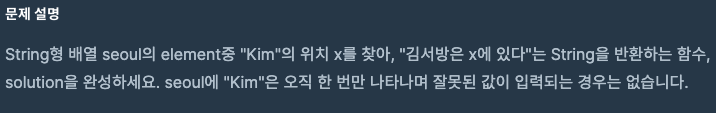

- **문제**

<br>

- **풀이**
```javascript
function solution(seoul) {
    for(let i = 0; i < seoul.length; i++)
        if (seoul[i] === "Kim") return `김서방은 ${i}에 있다`;
}
```
<br>

배열을 하나씩 돌리면서 "Kim"이 들어간 배열이 있는지 비교를 한다.
`==`이 아니라 `===`을 쓴 이유는 자료형까지 비교하기 위함이다.