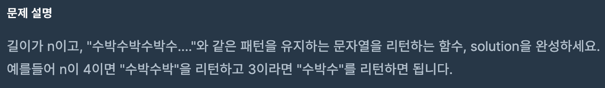

### 문제


<br>

### 풀이
```javascript
function solution(n) {
    var answer = '';
    for(var i = 0; i < n; i++) {
        if(i%2==0) answer += '수';
        if(i%2==1) answer += '박';
    }
    return answer;
}
```
<br>

answer 변수를 먼저 string으로 선언을 해준다.<br>
그리고 for문을 0부터, n개만큼 찍히기 때문에 n번 돌린다.<br>
<br>

2로 나누어서 나머지가 0이면 **짝수**이기 때문에 `수`를 answer에 넣고<br>
2로 나누어서 나머지가 1이면 **홀수**이기 때문에 `박`을 answer에 넣는다.<br>
<br>

### 추가된 점
Javscript 내부함수인 **`repeat()`** 과 **`substring()`** 을 이용하는 방법입니다.<br><br>

- **`repeat()`** 메소드는 문자열을 주어진 횟수만큼 반복해 붙인 새로운 문자열을 반환합니다.<br>

```javascript
'abc'.repeat(0);    // ''
'abc'.repeat(1);    // 'abc'
'abc'.repeat(2);    // 'abcabc'
```
<br>

- **`substring()`** 메소드는 string 객체의 **시작 인덱스**로부터 **종료 인덱스 전**까지 문자열의 부분 문자열을 반환합니다.
<br>

```javascript
const str = 'Mozilla';

console.log(str.substring(1, 3));
// expected output: "oz"

console.log(str.substring(2));
// expected output: "zilla"
```
<br>

### 최종 수정안
```javascript
function solution2(n) {
    return '수박'.repeat(n).substring(0,n);
}
```
'수박'을 n번 반복시키고,0번째부터 n번째 전까지 문자열을 잘라서 반환한다.<br>
<br>
n이 3이라고 가정하면 '수박수박수박' 문자열을 만들고,<br>
0번째부터 3번째 전 까지의 남은 문자열인 '수박수'을 반환한다.