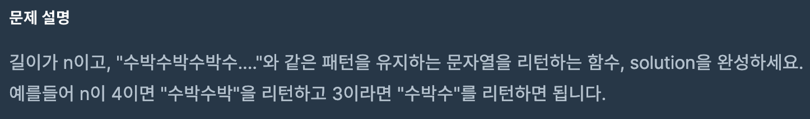

- **문제**

<br>

- **풀이**
```javascript
function solution(n) {
    var answer = '';
    for(var i = 0; i < n; i++) {
        if(i%2==0) answer += '수';
        if(i%2==1) answer += '박';
    }
    return answer;
}
```
<br>

answer 변수를 먼저 string으로 선언을 해준다.
그리고 for문을 0부터, n개만큼 찍히기 때문에 n번 돌린다.

2로 나누어서 나머지가 0이면 **짝수**이기 때문에 `수`를 answer에 넣고
2로 나누어서 나머지가 1이면 **홀수**이기 때문에 `박`을 answer에 넣는다.