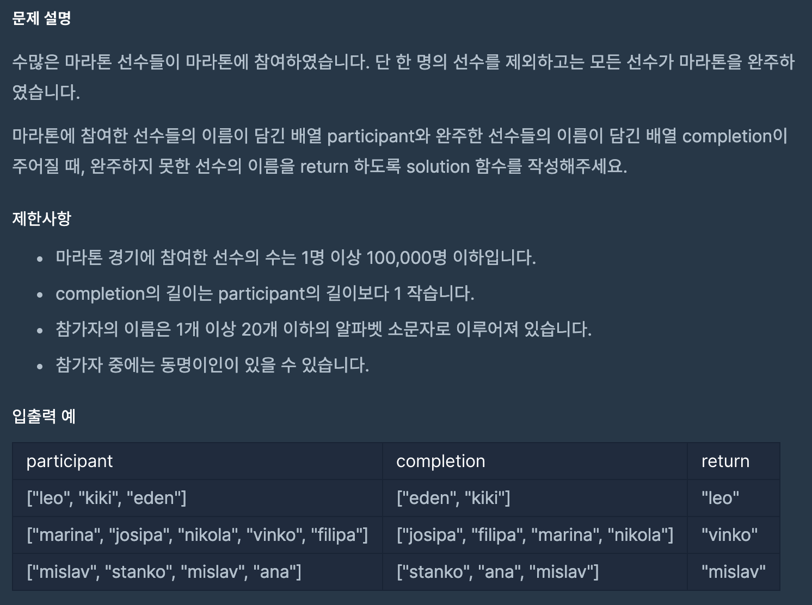

### 문제


<br>

### 풀이
```javascript
function solution(participant, completion) {
    participant.sort();
    completion.sort();
    for(var i=0; i<participant.length; i++){
        if(participant[i] !== completion[i]){
            return participant[i];
        }
    }
}
```
<br>

먼저 parameter로 받은 **참가자**와 **완주자**배열의 순서가 다르기 때문에, 각각 `sort()` 메소드로 정렬시킨다.<br>
> 정렬을 시키는 이유는 비교를 하기 위함이다.<br>
참가자와 완주자를 똑같은 알고리즘으로 정렬하여 같은 배열의 위치에 둘 수 있도록 한다.<br>
(이때, 정렬 알고리즘은 [여기](https://developer.mozilla.org/ko/docs/Web/JavaScript/Reference/Global_Objects/Array/sort)를 참고)<br>

<br>

그 후, 참가자만큼 반복문을 돌린다.<br>
참가자와 완료자를 비교했을 시 해당 이름이 같지 않을 시, 그 배열을 반환한다.