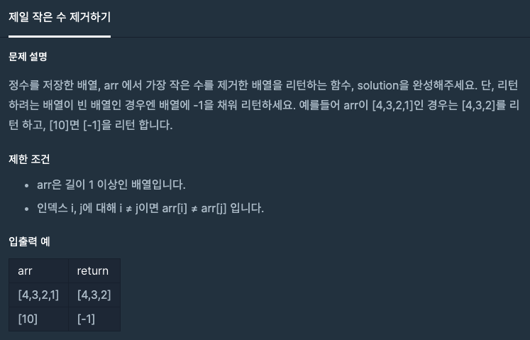

# 제일 작은 수 제거하기

1. 문제


2. 문제 풀이
```java
import java.util.ArrayList;
import java.util.Arrays;
import java.util.List;

class Solution {
    public int[] solution(int[] arr) {
        int min = 2147483647; // min에 최댓값 선언
        int minIdx = 0;
        if(arr.length == 1){ // 배열의 길이가 1이라면 arr[0]에 -1을 저장한 후 리턴
            arr[0] = -1;
            return arr;
        } else { // 아니라면
            for(int i=0; i<arr.length; i++){ // 배열의 길이만큼 반복
                if(min > arr[i]) { // min의 크기보다 작다면 arr[i]를 min 에 삽입하고 minIdx 에 i 삽입
                    minIdx = i;
                    min = arr[i];
                }
            }

            Integer integerArr[] = Arrays.stream(arr).boxed().toArray(Integer[]::new); // int[]에서 Inteeger로 형변환
            List<Integer> temp = new ArrayList<Integer>(Arrays.asList(integerArr)); // integerArr를 List로 감싸줘서 .remove() 메소드(내부 함수)를 사용할 수 있게 변환
            temp.remove(minIdx); // .remove()를 사용하여 minIdx 번째의 값을 제거
            return temp.stream().mapToInt(i -> i).toArray(); /// List<Integer> 형을 int[] 형으로 변환하며 리턴 
        }
    }
}
```

3. 다른사람의 풀이를 보고 느낀점

```java
import java.util.Arrays;
import java.util.stream.Stream;
import java.util.List;
import java.util.ArrayList;

class Solution {
  public int[] solution(int[] arr) {
      if (arr.length <= 1) return new int[]{ -1 };
      int min = Arrays.stream(arr).min().getAsInt();
      return Arrays.stream(arr).filter(i -> i != min).toArray();
  }
}
```

진짜 소름이다.   
Arrays의 내부함수를 더 많이 쓰는 경험을 해야할것같다는 생각을 했다.