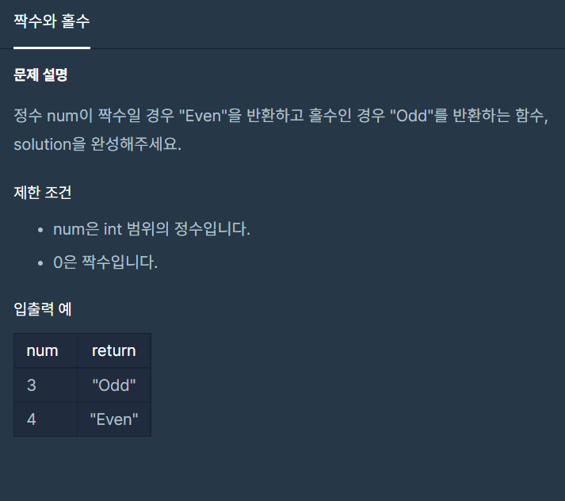

# 짝수와 홀수



# 문제 풀이

```java
public String solution(int num) {//num의 범위는 int 범위의 정수입니다. 0은 짝수입니다.
    String answer = "";
    return answer = (num % 2 == 0) ? "Odd" : "Even"; // num % 2 == 0 이 true일 경우 Odd를 answer에 대입, false일 경우 Even을 answer에 대입한 후 반환
    }
```