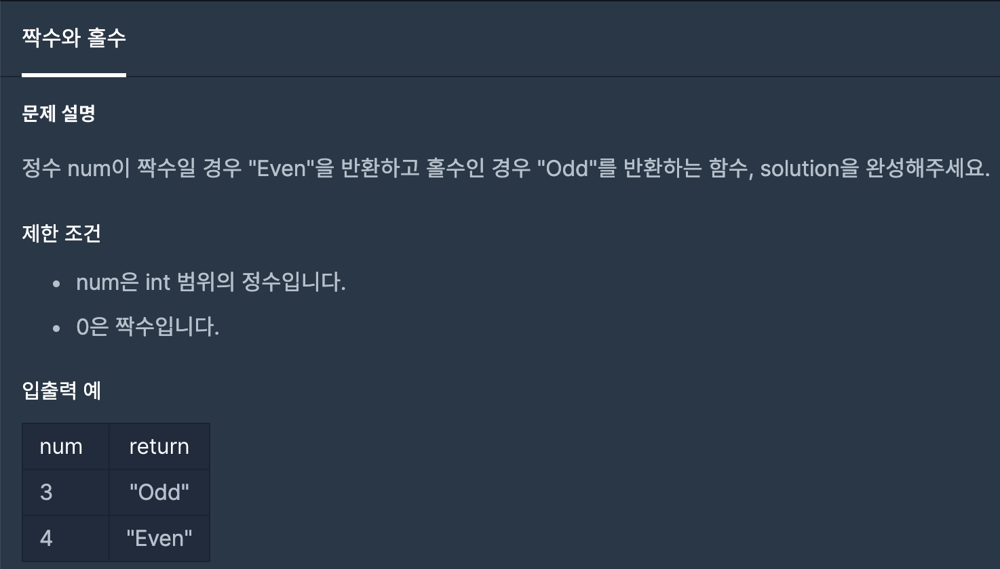

# 짝수와 홀수

1. 문제


2. 문제풀이
```java
public static String Solution(int num){
    String answer = (num % 2 == 0) ? "Even" : "Odd"; // 3항연산자를 사용하여 짝수(참) 이면 answer 에 "Even" 저장, 홀수(거짓) 이면 answer에 "Odd" 저장 
    return answer;
}
```