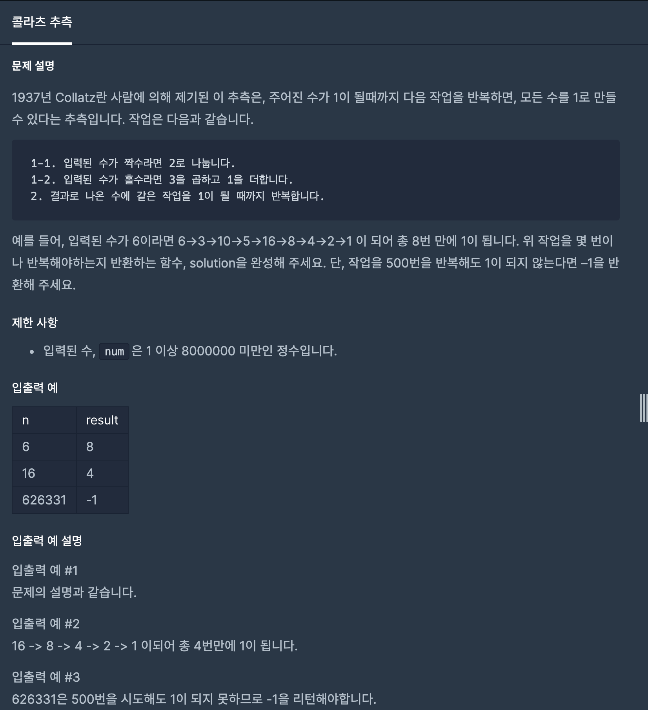

# 콜라츠 추측

1. 문제


2. 문제 풀이
```java
public int solution(int num) { // 숫자를 입력 받음.
    int answer = 0; // 답을 리턴할 answer 선언

    while (num != 1){ num 이 1이 아니라면 
        if(num % 2 == 0){ // 짝수라면
            num /= 2; num 을 2로 나누고 저장
        }
        else if(num % 2 == 1){ // 홀수라면
            num = num * 3 + 1; // num에 3을 곱하고 1로 더함
        }
        answer += 1;  // 몇번 리턴했는지 세기위해 += 1
        if(answer == 500){ // answer가 500 이라면
            answer = -1; // answer의 값을 -1로 지정
            break; // 반복문 중단
        }
    }
    return answer; // answer 리턴
}
```
3. 다른사람의 풀이를 보고느낀점
- 다른 사람들의 풀이는 3항연산자 ( 조건식 ? 값 or 연산식 : 값 or 연산식 ; ) 을 많이 사용했다.