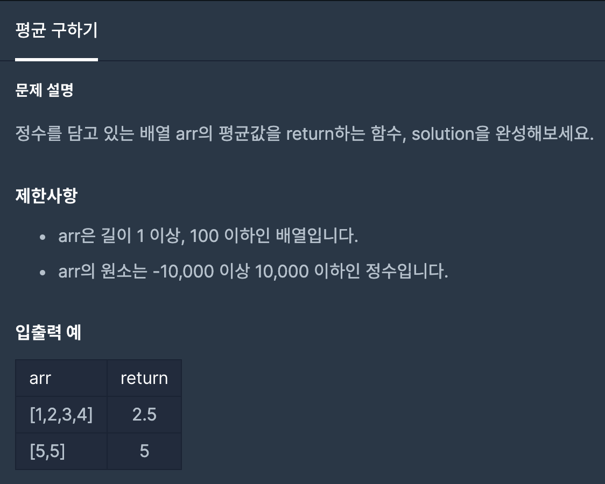

# 평균 구하기



# 문제 풀이

```java
class Solution {
    public static double solution(int[] arr){
        double answer = 0; // 소수점이 나올 수 있기 때문에 double타입 사용
        for(int i = 0; i < arr.length; i++){ //배열의 원소만큼 더해야하기 때문에 arr.length를 사용함
            answer += arr[i]; // 배열에 있는 원소값을 answer에 더함
        }
        return answer/arr.length; // 평균을 구해 반환
    }
}
```