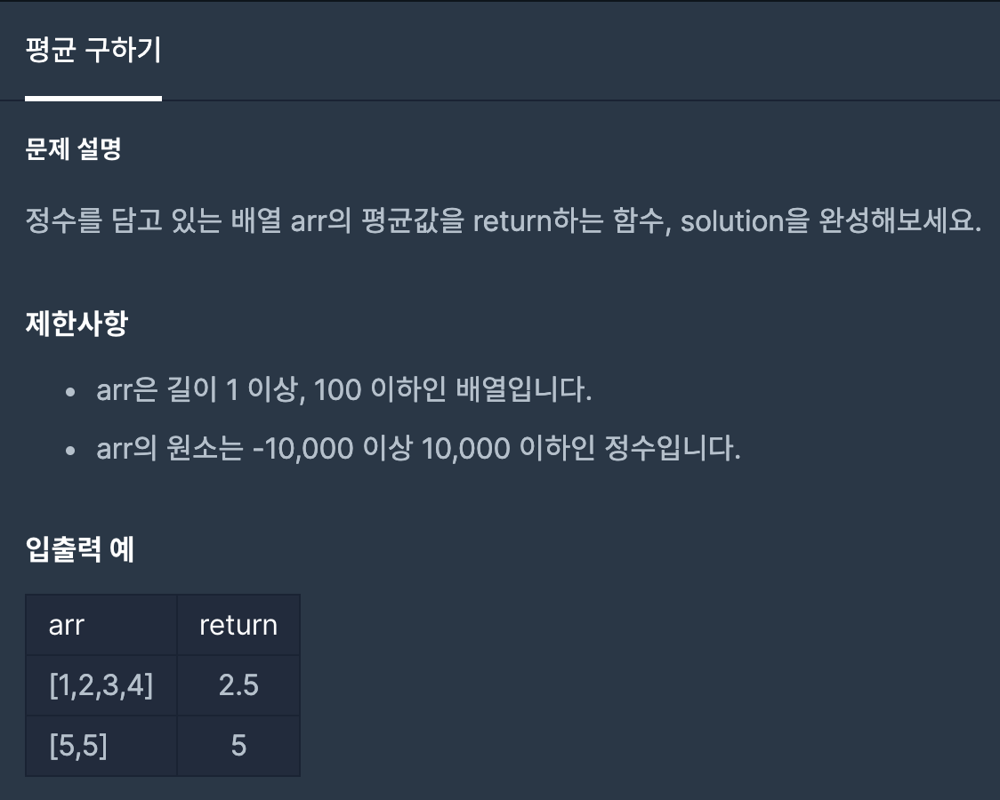

# 평균 구하기

1. 문제


2. 문제 풀이
```java
public static double solution(int[] arr) {
    int sum = 0; // 총합을 받을 변수 선언
    for(int i = 0; i < arr.length; i++){ // arr의 길이만큼 반복
        sum += arr[i]; // sum 에 배열의 값 삽입
    }
    double answer = (double) sum / arr.length; // sum / arr.length로 평균 구하기
    return answer; // answer 반환

    // ============= 번외 풀이 ================= //
//    return (double) Arrays.stream(arr).average().orElse(0); // Arrays 클래스의 strem을 이용하여 arr를 조작하고 arr의 평균을 구하고 arr의 값이 없다면 0을 반환
}
```

3. 다른사람의 풀이를 보고느낀점
- Java의 라이브러리중 하나인 Arrays 클래스를 공부하고 Stream을 이해해야겠다는 생각을 했다.