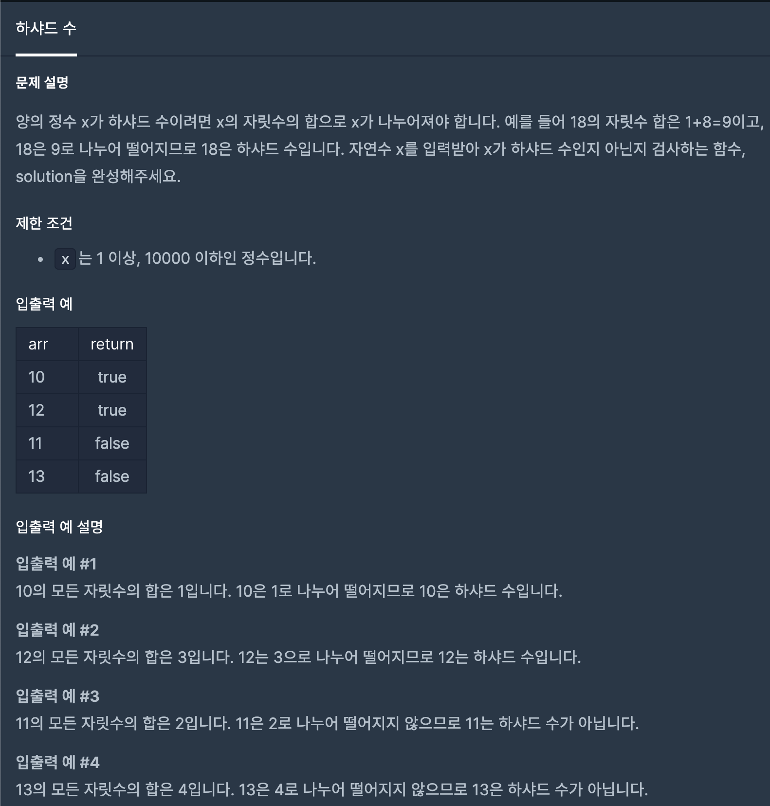

# 하샤드 수



# 문제 풀이

```java
public static boolean solution(int harshad){
        int number = 0; // 
        String[] strArr = Integer.toString(harshad).split(""); //먼저 받아온 harshad를 String으로 변환 후 문자열 배열로 삽입합니다.
        for(String jas:strArr){//for each로 각 요소에 있는 문자열로 된 수들을 꺼냅니다
            number += Integer.parseInt(jas); // 꺼낸 수들은 한 자릿수로 나오기 때문에 number에 더합니다.
        }
        if(harshad%number==0){// 하샤드 수를 number랑 나누어 몫이 0일 경우 하샤드 수이므로 true를 반환합니다.
            return true;
        }
        return false; // 위 경우가 아닐 경우 하샤드 수가 아니므로 false를 반환합니다.
}
```
