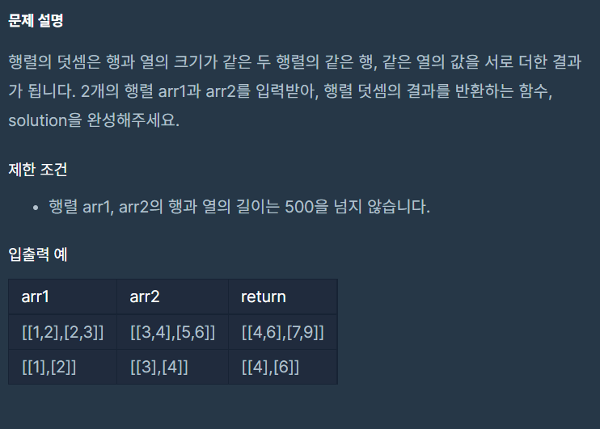

# 문제



## 문제 풀이

```java
public static int[][] solution(int[][] arr1, int[][] arr2) {
        int[][] answer = new int[arr1.length][arr1[0].length]; // 행과 열의 길이
        answer = arr1; // arr1과 arr2를 더하기 때문에 answer를 arr1로 로 만듦
        for (int i = 0; i < arr1.length; i++) {
            for (int j = 0; j < arr1[0].length; j++) {
                answer[i][j] += arr2[i][j]; // 같은 행열끼리 덧셈
            }
        }
        return answer; // 답 반환
    }
```

1. answer를 2차원 배열로 선언한 후 배열의 크기를 arr1의 길이와 arr1[0]의 길이로 지정한다(arr1과 arr2의 길이는 같으므로)

2. arr1과 arr2의 같은 행열끼리 더해 결과를 도출하므로 answer에 arr1을 대입한다.

3. 행열의 크기가 `같으므로 반복문의 반복횟수 또한 `arr1.length`와 `arr1[0].length`로 지정한다

4. answer와 arr2의 같은 행열끼리 더 하여 answer에 저장한다.

5. answer를 반환한다.
