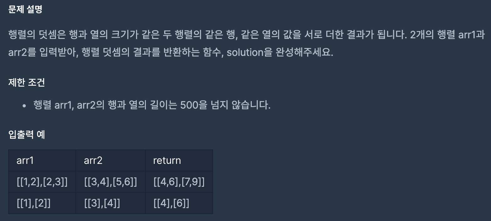

# 행렬의 덧셈

1. 문제



2. 코드 설명
```java
public int[][] solution(int[][] arr1, int[][] arr2) {
    int[][] answer = new int[arr1.length][arr1[0].length]; // 정답을 리턴할 answer 배열을 선언해준다. 이때 크기는 파라미터에서 받은 배열의 길이 만큼 선언해준다.

    for(int i = 0; i < arr1.length; i++){ // 열의 길이만큼 반복한다.
        for(int j = 0; j < arr1[0].length; j++){ // 행의 길이 만큼 반복한다.
            answer[i][j] = arr1[i][j] + arr2[i][j]; // answer 배열에 arr1[i][j] 의 값과 arr2[i][j] 의 값을 더하여 넣어준다.
        }
    }

    return answer; // 정답을 리턴한다.
}
```